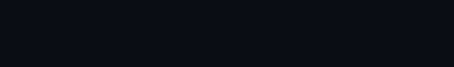

## Hi, I'm nandodev 

I'm Fernando González a Full Stack Web and Mobile Developer based in New Jersey USA. I Spend most of time coding outstanding projects or creating posts for my blog [nandodev.net](https://nandodev.net).

 

  

:mailbox: Reach me out!

  &nbsp;&nbsp;&nbsp;&nbsp;
   
  &nbsp;&nbsp;&nbsp;&nbsp; 
   
    

  <!--  
    -->

<!-- TODO: Add last video link -->

- 🔭 I’m currently looking new job opportunities.
- 🤔 I’m looking for help with Outstanding Video ideas.
- 📫 How to reach me: gonzalez89fer@gmail.com.
- ⚡ Fun fact: I play games and go to the GYM very often.

 

### Top Technologies

   &nbsp;&nbsp;&nbsp;&nbsp;
   &nbsp;&nbsp;&nbsp;&nbsp;
   &nbsp;&nbsp;&nbsp;&nbsp;
   &nbsp;&nbsp;&nbsp;&nbsp;
   &nbsp;&nbsp;&nbsp;&nbsp;
   &nbsp;&nbsp;&nbsp;&nbsp;
   &nbsp;&nbsp;&nbsp;&nbsp;
   &nbsp;&nbsp;&nbsp;&nbsp;
   &nbsp;&nbsp;&nbsp;&nbsp;
  

 
 
 

#### Bizness
- :paperclip: [My Resume/CV](https://github.com/nandodev-net/nandodev-net/blob/main/assets/resume/nandodevResume.pdf)
- :email: gonzalez89fer@gmail.com

<!--
**nandodev-net/nandodev-net** is a ✨ _special_ ✨ repository because its `README.md` (this file) appears on your GitHub profile.

Here are some ideas to get you started:

- 🔭 I’m currently working on ...
- 🌱 I’m currently learning ...
- 👯 I’m looking to collaborate on ...
- 🤔 I’m looking for help with ...
- 💬 Ask me about ...
- 📫 How to reach me: ...
- 😄 Pronouns: ...
- ⚡ Fun fact: ...
-->